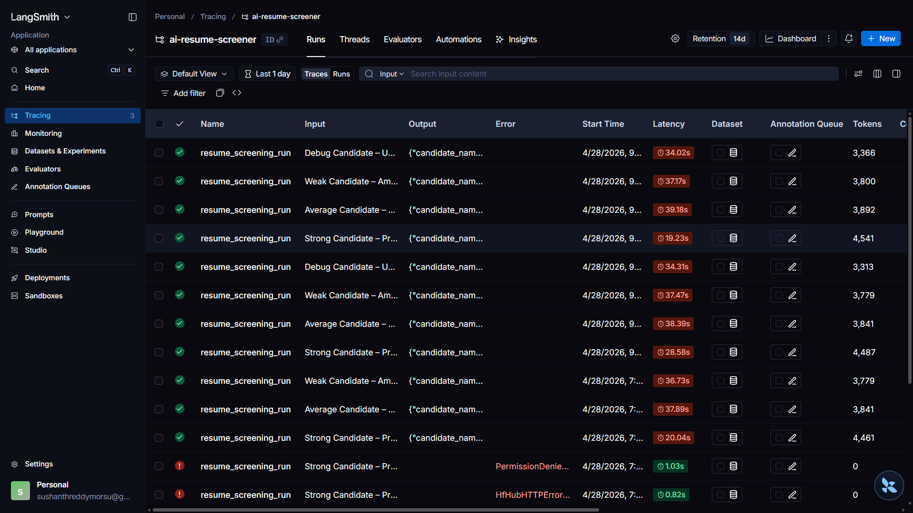
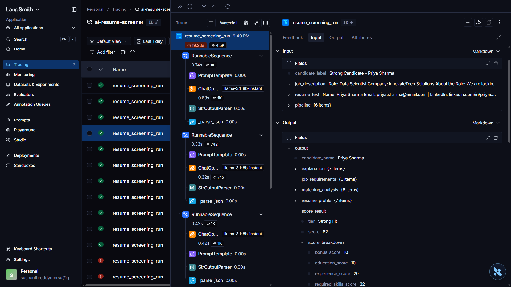
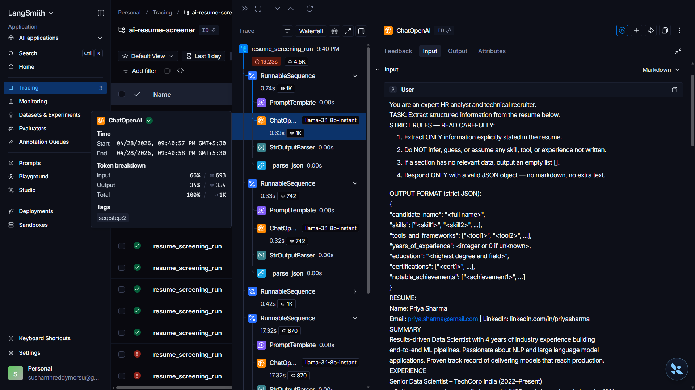
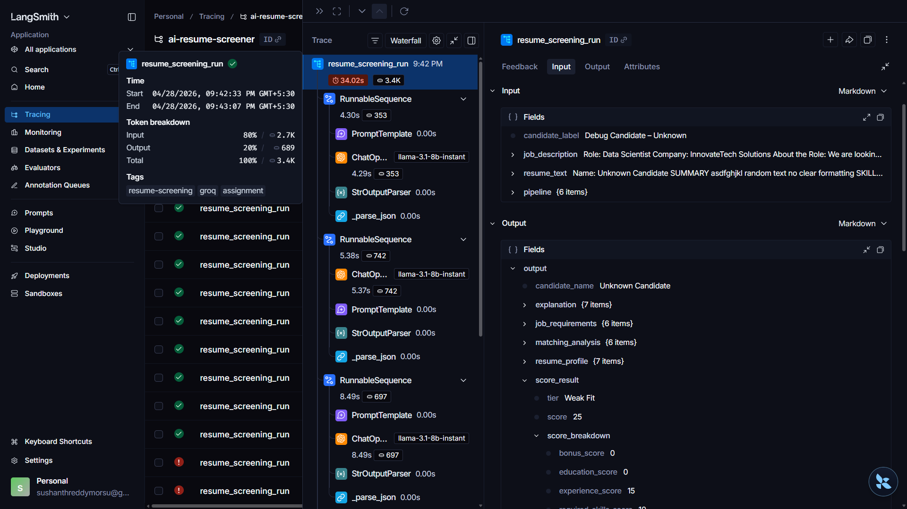
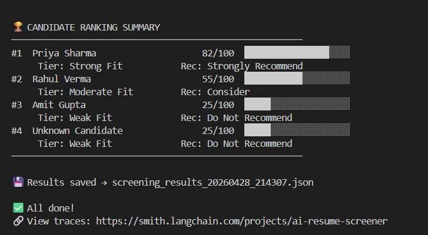

# 🤖 AI Resume Screening System

> **Data Science Internship — GenAI Assignment**  
> Built with **LangChain · Groq · LangSmith**

---

## 📋 Overview

An end-to-end AI-powered Resume Screening System that helps recruiters evaluate candidates automatically using Generative AI.

This project:

- Extracts candidate skills, tools, education, and experience
- Matches resumes against a Job Description
- Calculates a transparent **Fit Score (0–100)**
- Generates explainable hiring recommendations
- Uses **LangSmith tracing** for monitoring and debugging
- Handles malformed / low-quality resume inputs gracefully

---

## 🎯 Objective

Build a production-style AI recruitment assistant using LangChain that screens resumes intelligently.

### Input

- Resume Text
- Job Description

### Output

- Candidate Skill Extraction
- Job Match Analysis
- Fit Score
- Hiring Recommendation
- Explainable Summary

---

## 🏗️ Project Structure

```text
AI-Resume-Screener/
│
├── main.py
├── notebook.ipynb
├── requirements.txt
├── .env.example
├── README.md
│
├── prompts/
│   └── templates.py
│
├── chains/
│   └── screening_chain.py
│
├── resumes/
│   └── sample_data.py
│
└── screenshots/
    ├── dashboard.png
    ├── strong_trace.png
    ├── prompt_output.png
    ├── debug_trace.png
    └── ranking_terminal.png
```

---

## ⚙️ Pipeline Architecture

```text
Resume → Extract Skills → Extract JD → Match → Score → Explain → LangSmith Trace
```

---

## 🧠 Technologies Used

- Python
- LangChain
- LCEL (LangChain Expression Language)
- Groq API
- LangSmith
- Pydantic
- VS Code

---

## 🚀 Setup & Run

### 1️⃣ Clone Repository

```bash
git clone https://github.com/SushanthMorsu/AI-Resume-Screener.git
cd AI-Resume-Screener
```

### 2️⃣ Install Dependencies

```bash
pip install -r requirements.txt
```

### 3️⃣ Configure `.env`

```env
GROQ_API_KEY=your_groq_api_key
GROQ_MODEL=llama-3.1-8b-instant

LANGCHAIN_API_KEY=your_langsmith_api_key
LANGCHAIN_TRACING_V2=true
LANGCHAIN_PROJECT=ai-resume-screener
```

### 4️⃣ Run Project

```bash
python main.py
```

---

## 📸 Screenshots

### Dashboard


### Strong Candidate Trace


### Prompt Input + Output


### Debug Candidate Trace


### Ranking Summary


---

## 👨‍💻 Author

**Sushanth Morsu**

GitHub: https://github.com/SushanthMorsu
